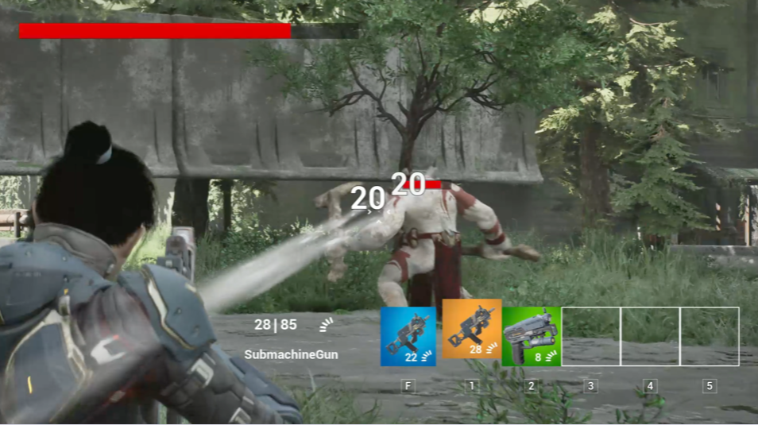

# Unreal Engine TPS Game

## 프로젝트 개요
언리얼 엔진을 사용하여 TPS(Third-Person Shooter) 게임을 개발하였으며, 플레이어가 다양한 무기를 사용하여 몬스터와 전투하는 게임입니다. 이 프로젝트는 TPS 장르의 특성을 반영하여 캐릭터 애니메이션, 무기 시스템, 몬스터 AI, 인벤토리 및 아이템 시스템을 구현했습니다.

<!-- ### GitHub Link
[Unreal Engine 5 TPS Game](https://github.com/SeoBYP/Unreal_Engine_5_TPS_Game) -->

---
## 프로젝트 요약
**기간**: 2023년 6월 - 2023년 8월
**플랫폼**: PC  
**Engine**: Unreal Engine  
**도구**: Git, C++  

---

## 구현 상세

#### 1. 캐릭터와 애니메이션
- **Animation Montage와 Blendspace 활용**: 캐릭터가 다양한 방향으로 자연스럽게 움직이도록 애니메이션을 설정했습니다. 또한, 고정된 조준 방향을 유지하면서 현실적인 움직임을 표현하도록 구현했습니다.
- **애니메이션 블루프린트**: 애니메이션 블루프린트를 통해 다양한 캐릭터 동작을 구성하고, 상황에 맞게 전환이 원활히 이루어지도록 설계했습니다.

#### 2. 무기 시스템
- **다양한 무기 구현**: 권총, SMG, 기관총 등 다양한 무기 유형을 구현하여 플레이어가 전투 상황에 맞는 무기를 선택할 수 있도록 하였습니다. 각 무기는 고유한 특징과 데미지 값을 가지고 있으며, 전투 전략에 따라 다른 플레이 경험을 제공합니다.
- **사격 메카닉 조절**: 조준 정확도, 사격 감도, 반동 등을 설정하여 플레이어가 각 무기를 효과적으로 사용할 수 있도록 했습니다.
- **무기 전환 및 애니메이션**: 무기 전환 시 부드러운 전환이 이루어지도록 전환 애니메이션을 추가하고, 시각적 매력을 더했습니다.
- **발사 및 재장전 애니메이션**: 각 무기의 발사와 재장전 애니메이션을 세밀하게 구현하여, 전투 상황에서 몰입감을 높였습니다.

#### 3. 몬스터 AI
- **Behavior Tree 사용**: Behavior Tree를 이용해 몬스터의 행동 패턴을 결정하는 논리적 구조를 구축했습니다. 몬스터는 Behavior Tree에 따라 상황에 맞게 이동하거나 플레이어를 공격하는 등 다양한 행동을 수행합니다.
- **Task와 Decorator 노드 활용**: Task와 Decorator 노드를 조합하여 몬스터의 다양한 행동 패턴을 설정하고, 특정 조건에 따라 반응하도록 AI를 구현했습니다.
- **블랙보드 및 데이터 키**: 블랙보드를 사용해 몬스터가 플레이어의 위치나 상태를 인식하도록 하고, 플레이어가 사망 시 몬스터의 움직임이 중단되도록 설정했습니다.

#### 4. 인벤토리 및 아이템 시스템
- **데이터 테이블 연동**: 아이템의 등급, 아이콘, 이름, 설명 및 효과를 데이터 테이블로 관리하여 아이템 정보가 쉽게 수정될 수 있도록 했습니다.
- **아이템 등급 및 효과**: 높은 등급의 아이템은 더 큰 데미지를 주거나 추가 효과를 가질 수 있도록 구현하여, 게임의 전략성을 높였습니다.
- **시각적 연출**: 아이템 등급에 따라 UI와 FX 효과를 차별화하여 시각적 매력을 강화했습니다.

---
